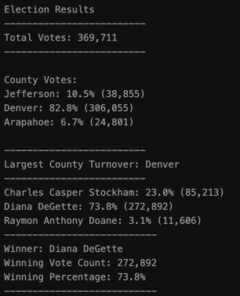
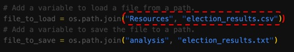

# Election Analysis

## Project overview
At the request of a Colorado Board of Elections, the following tasks were given to complete the election audit of a recent local congressional election.

1. Calculate the total number of votes cast.
2. Calculate the percentage of votes from each county and its voter turnout.
3. Determine the county with the largest voter turnout.
4. Calculate the percentage of votes each candidate won.
5. Determine the winner of the election based on popular vote.

## Resources
- Data Source: [election_resultes.csv](https://github.com/sharof17/Election_Analysis/blob/main/Resources/election_results.csv)
- Software: Python 3.7.6, Visual Studio Code 1.67.2

## Election Audit Results
The results were obtained from election audit analysis:
- **Total number of votes cast in the election:**
  - 369,711.
- **Results of Voter Turnout by County:**
  - Jefferson cast 10.5% of the vote (38,855 votes)
  - Denver cast 82.8% of the vote (306,055 votes)
  - Arapahoe cast 6.7% of the vote (24,801)
- **Largest County Turnover:**
  - Denver, with 82.8% of the vote (306,055 votes)
- **Candidate results**
  - Charles Casper Stockham received of the vote 23.0% (85,213 votes)
  - Diana DeGette received of the vote 73.8% (272,892 votes)
  - Raymon Anthony Doane received of the vote 3.1% (11,606 votes)
- **The winner of the election**
  - Diana DeGette, who received of the vote 73.8% (272,892 votes)

*Screenshot of obtained results*

  
## Summary

The script ([PyPoll_Challange.py](https://github.com/sharof17/Election_Analysis/blob/main/PyPoll_Challenge.py)) utilized to conduct the audit analysis is very useful tool for the election commission because the code is customizable and can be modified easily. It can be applied to any electoral dataset by changing the data source on the code provided that the structure of the dataset stays the same. It can be seen on the following screenshot:

Also, it is important to state that the script can be used for any sort of election. For example, to conduct analysis for federal elections, the input "county" can be changed to "state". 

Moreover, it is possible to make some deeper modifications to the script, to get more detailed results. e.g., percentage of each county voted for each candidate.

